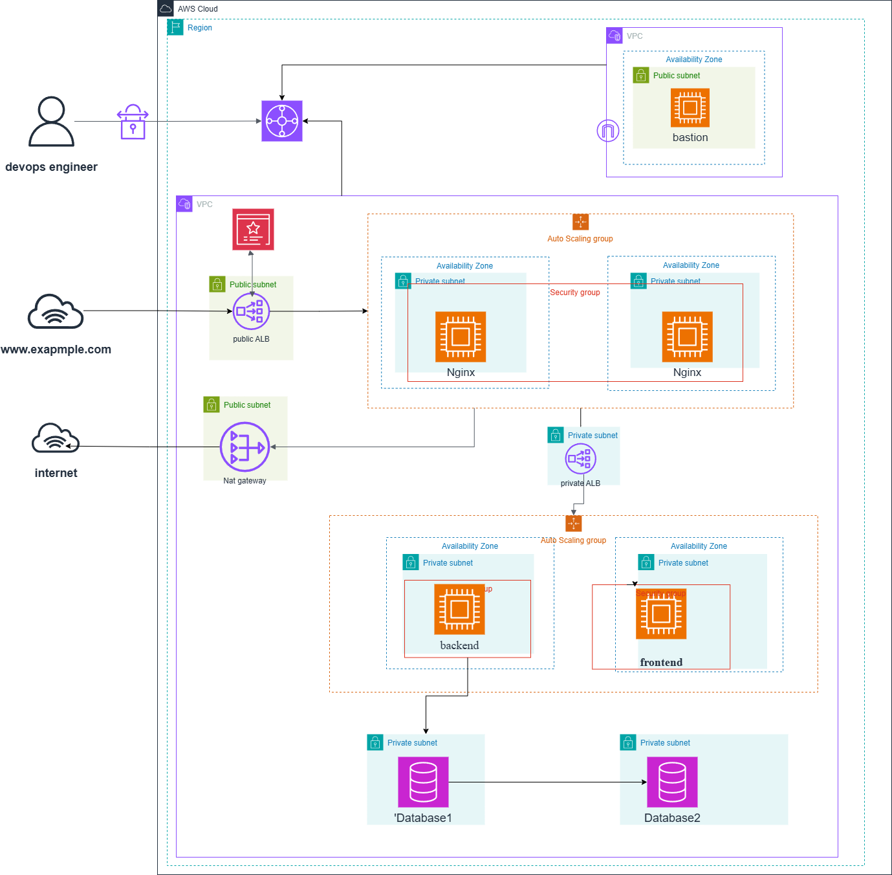

# Deploy Wثلا Application on AWS 3-Tier Architecture


---
---

# Project Overview

## Introduction

This project demonstrates the deployment of a production-grade inventory  web application using AWS's robust 3-tier architecture. The implementation follows cloud-native best practices, ensuring high availability, scalability, and security across all application tiers.

### Key Features

- **High Availability**: Multi-AZ deployment with automated failover
- **Auto Scaling**: Dynamic resource allocation based on demand
- **Security**: Defense-in-depth approach with multiple security layers
- **Monitoring**: Comprehensive logging and monitoring setup
- **Cost Optimization**: Efficient resource utilization and management


### Infrastructure Components

1. **Presentation Tier (Frontend)**
   - Nginx web servers in Auto Scaling Group
   - Public-facing Network Load Balancer

2. **Application Tier (Backend) and (frontend)**
   - backend asg and frontend asg
   - Internal Network Load Balancer

3. **Data Tier**
   - Amazon RDS postgresql in Multi-AZ configuration
   - Automated backups and point-in-time recovery
   - Read replicas for read-heavy workloads (using neon for devlopment)

### Network Architecture

- **VPC Design**
  - Two separate VPCs 
  - Public and private subnets across multiple AZs
  - Transit Gateway for inter-VPC communication 
  - ( use peering in development )

# Pre-Requisites

## Required Accounts and Tools

### 1. AWS Account Setup

### 2. Development Tools
- **Git**: Version control system
- **docker**: Version control system
- **docker compose**: Version control system
- **ansible**: Version control system
- **jenkins**: Version control system


# Infrastructure Setup




The infrastructure consists of:

- VPC with public and private subnets across multiple availability zones
- External Application Load Balancer (ALB) in public subnets facing the internet
- Internal Application Load Balancer (Internal ALB) routing traffic to private instances
- Auto Scaling Group (ASG) managing EC2 instances in private subnets
- Bastion host for secure SSH access to private instances
- NAT Instance for outbound internet access from private subnets
- Security groups with least-privilege access rules
- Nginx proxy server routing traffic to the internal ALB


## Prerequisites

### 1. Tools Required

- Terraform >= 1.0.0
- AWS CLI >= 2.0.0

### 2. Configure Variables

Create a `terraform.tfvars` file:

```hcl
# General
aws_region  = "eu-west-1"
environment = "dev"
name        = "inventory"
 
# Networking
vpc_cidr           = "192.168.0.0/16"
public_subnets     = ["192.168.1.0/24", "192.168.2.0/24"]
nginx_subnets      = ["192.168.3.0/24", "192.168.4.0/24"]
internal_alb_subnets = ["192.168.5.0/24", "192.168.6.0/24"]
front_subnets      = ["192.168.7.0/24"]
backend_subnets    = ["192.168.8.0/24"]
availability_zones = ["eu-west-1a", "eu-west-1b"]
 
# EC2
instance_type        = "t2.nano"
key_name             = "ec2-key"
asg_min_size         = 1
asg_max_size         = 2
asg_desired_capacity = 1
 
# Security
allowed_ssh_cidr_blocks = ["your.ip.address/32"]
bastion_cider           = "your.ip.address/32"
```
### 3. Plan the Infrastructure

```bash
terraform plan -out=tfplan
```

### 4. Apply the Infrastructure

```bash
terraform apply tfplan
```

### 5. Destroy the Infrastructure

```bash
terraform destroy
```

## Templates

### `templates/nginx_user_data.sh.tpl`

Bootstraps the Nginx server on first launch. Installs Nginx and configures it as a reverse proxy pointing to the Internal ALB.

### `templates/app_user_data.sh.tpl`

Bootstraps the frontend application instances. Installs Docker, pulls the frontend image, and starts the container.

---

## Security Considerations

### Network Security
- All application servers are in private subnets with no direct internet access
- Only the external ALB is exposed to the internet
- Private instances access the internet only through the NAT Instance
- SSH access to private instances only through the Bastion host

### Access Management
- Security groups follow least-privilege — each component only allows traffic from the component directly upstream
- Bastion host restricts SSH access to specific IP addresses only
- NAT instance has source/destination check disabled as required

### State Management
- `terraform.tfstate` contains sensitive infrastructure details — do not commit to Git
- Add to `.gitignore`:

```
terraform.tfstate
terraform.tfstate.backup
*.tfvars
.terraform/
```

# Ansible Configration 

After applying, use Terraform outputs to populate your Ansible inventory:

```bash
# Get bastion IP

# Get nginx private IP
# Get backend private IP
# Get frontend IP
# Get internal ALB DNS
# get   teh location of the ss_key.pem with the write premsion
```

Then update `ansible_config/vars/secrets.yml` 

```yaml
bastion_host: ""
nginx_host: ""
front_host: ""
backend_host: ""
ansible_user: "ubuntu"
ssh_key_path: ""
alb_host: ""
alb_port: 80   
nginx_listen_port: 80
keepalive: 32
```


# Application Setup

## Build Environment

### 1. build the frontend and backend 


### 2. Build Process
```bash
# update the dockerfile in the front directory if needed 

# update the dockerfile in  backend directory if needed

# update the docker-compose.yml file for your configurations

# run  and test 
docker compose up -d 
# after test 
docker compose down

```

#  Jenkins CI/CD Pipeline: Automated Deployment

This repository contains a **Declarative Jenkins Pipeline** designed to automate the deployment of a full-stack application (Frontend & Backend) using **Ansible** and **Docker**.

##  Overview
The pipeline is **change-aware**. It uses Git logic to detect which part of the application was updated and only deploys the modified component, making the CI/CD process faster and more efficient.

---

##  Prerequisites

### 1. Jenkins Plugins
Ensure the following plugins are installed on your Jenkins server:
* **Pipeline**
* **SSH Agent Plugin**
* **Git Plugin**
* **Credentials Binding Plugin**

### 2. Required Credentials
The pipeline expects the following IDs to be configured in **Jenkins Manage Credentials**:

| Credential ID | Type | Description |
| :--- | :--- | :--- |
| `ansible-key` | Secret Text | Password for Ansible Vault files. |
| `.env` | Secret File | The production environment variables file. |
| `ec2-ssh-key` | SSH Username with Private Key | SSH key to access your target deployment servers. |

---

## 🏗 Pipeline Stages

###  1. Detect Changes
The pipeline compares the current commit (`HEAD`) with the previous one (`HEAD~1`).
* It sets flags for `ANSIBLE_CHANGED`, `FRONTEND_CHANGED`, and `BACKEND_CHANGED`.
* If no changes are detected in a specific folder, that deployment stage is skipped.

### 2. Environment Preparation
* **Vault Setup:** Securely creates a `vault_pass.txt` from Jenkins credentials.
* **Key Management:** Starts an `ssh-agent` and maps the SSH key to a temporary path for Ansible.
* **Inventory Generation:** Runs a specialized Ansible playbook (`generate_inventory.yaml`) to dynamically build the server list.

###  3. Deployment Stages
The pipeline uses **Ansible Tags** to target specific parts of the infrastructure:
* **Deploy Frontend:** Triggered if `frontend/` changes. Uses `--tags front`.
* **Deploy Backend:** Triggered if `backend/` changes. Uses `--tags backend`.
* **Deploy Ansible:** Full configuration run to ensure server consistency.

###  4. Post-Build Cleanup
To maintain security, the pipeline **always** deletes sensitive files after execution:
* Removes `vault_pass.txt`.
* Removes the temporary SSH private key from `/tmp/ansible/`.

---

##  How to Use

1.  **Clone the repo:**
    ```bash
    git clone <your-repo-url>
    ```
2.  **Configure Jenkins:** Create a new "Pipeline" job and point it to your `Jenkinsfile`.
3.  **Push Changes:**
    * Pushing to `frontend/` will trigger a Frontend-only deploy.
    * Pushing to `backend/` will trigger a Backend-only deploy.
    * Pushing to `ansible_config/` will trigger an infrastructure update.

---

##  Security Note
> **IMPORTANT:** This pipeline handles sensitive data. The `post { always { ... } }` block is critical as it ensures that even if a build fails, your Ansible Vault passwords and SSH keys are wiped from the Jenkins agent workspace.
---

##  Support the Project

If you found this project helpful, please consider:
- **Starring**  the repository
- **Sharing** it with your network
- **Contributing** to its improvement

# Contribution 
 - Networking Upgrade: Replace the NAT Instance with a NAT Gateway and migrate VPC peering to a Transit - Gateway for better scalability.

 - Image Optimization: Develop a Terraform module to generate custom AMIs (Amazon Machine Images) to  - achieve faster deployment times.

 - Database Migration: Update the application to utilize AWS RDS and decommission the Neon database to ensure a production-ready environment.

 - IaC Integration: Automate the hand-off between layers by integrating Terraform outputs directly with Ansible configurations.

> [!Important]
> This documentation is continuously evolving. For the latest updates, please check the repository regularly.
